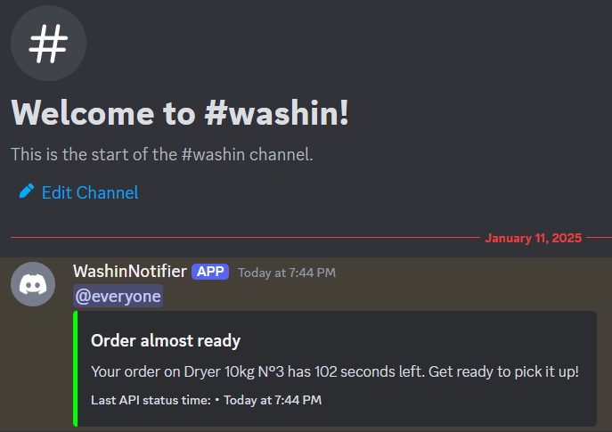
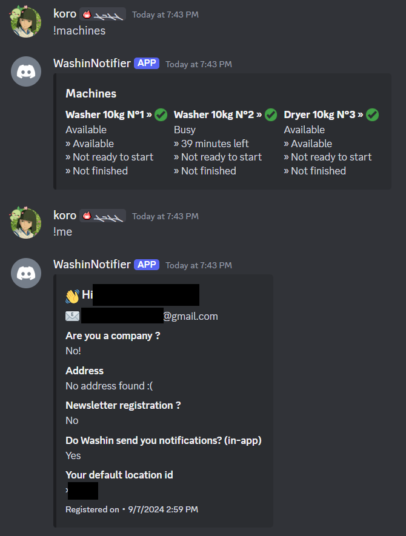

    <h1>WashinNotifBot</h1>
    <h3>Gives you notifications about your current Washin order</h3>

<h1>Why does this project exists?</h1>
i have some notification issues on Washin, so I decided to create a bot that sends me notifications about my current order. although the code is not clean, it works well.

<h1>How does it work</h1>
the bot uses the *unofficial* (rev-enged) Washin API to get the current order status, then it sends a notification to the user using your discord bot. will probably make it in the future so that it can send it to a webhook idk

<h1>How to use</h1>
1. make sure you follow the system requirements (basically having nodejs)
2. clone the repository
3. install the dependencies using `npm install`
4. create a discord bot and get the token
5. move example.env to .env and fill the values
6. compile using `tsc`
7. run the bot using `node dist/index.js`
8. you should see a message in the console saying that the bot is ready
9. you can now use the bot

<h1>Contribution</h1>
feel free to contribute, also this project doesnt have any license so you can do whatever you want with it (but please do not sell it, let's keep it open source)

<h1>Commands</h1>
also there are 2 basic commands which you can use
